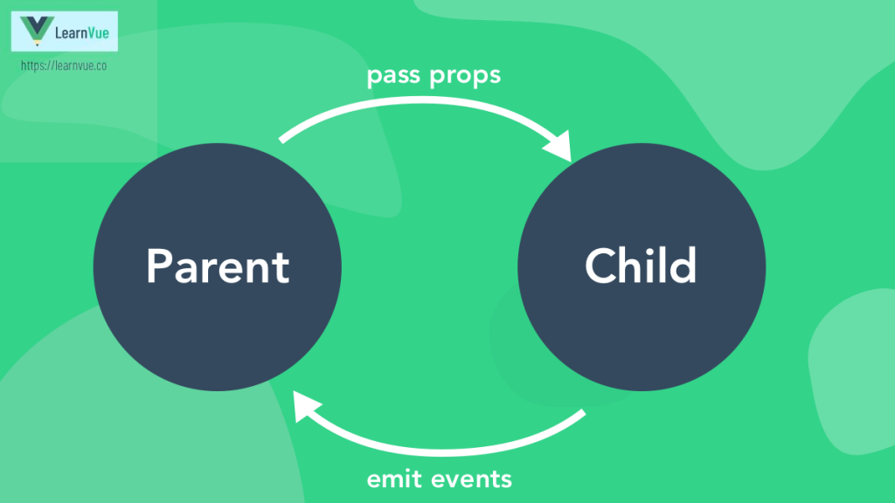
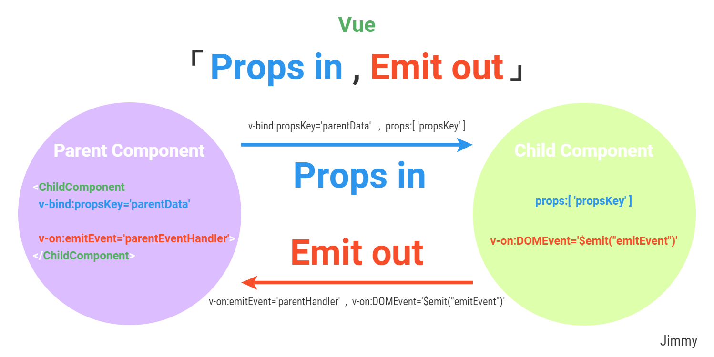
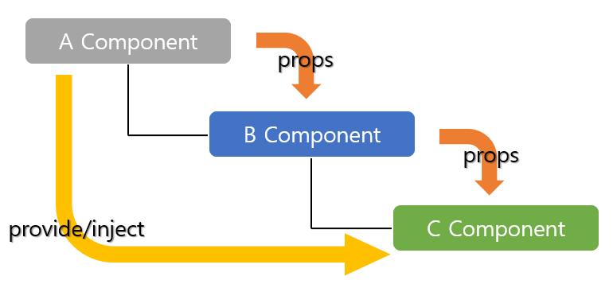

# tiya-golf-club

This template should help get you started developing with Vue 3 in Vite.

## Recommended IDE Setup

[VSCode](https://code.visualstudio.com/) + [Volar](https://marketplace.visualstudio.com/items?itemName=Vue.volar) (and disable Vetur) + [TypeScript Vue Plugin (Volar)](https://marketplace.visualstudio.com/items?itemName=Vue.vscode-typescript-vue-plugin).

## Customize configuration

See [Vite Configuration Reference](https://vitejs.dev/config/).

## Project Setup

```sh
npm install
```

### Compile and Hot-Reload for Development

```sh
npm run dev
```

### Compile and Minify for Production

```sh
npm run build
```

<p align="center"><a href="public/props-diagram.png" target="_blank"></a></p>
<p align="center"><a href="public/props-diagram1.png" target="_blank"></a></p>
<p align="center"><a href="public/component-provide-inject.png" target="_blank"></a></p>
<p align="center"><a href="public/provide-inject-use (1).png" target="_blank"></a></p>
